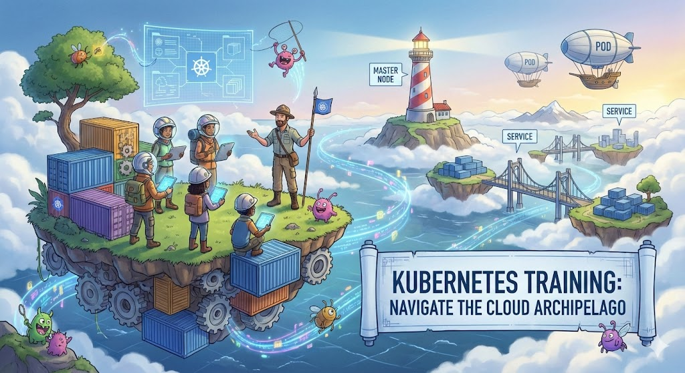

# Indice

- [Indice](#indice)
- [Descomplicando o Kubernetes - Expert Mode](#descomplicando-o-kubernetes---expert-mode)
  - [Conteúdo](#conteúdo)
- [Como usar o Laboratorio do Girus](#como-usar-o-laboratorio-do-girus)
  - [Instale Girus CLI](#instale-girus-cli)
  - [Crie o Cluster](#crie-o-cluster)
  - [Importe um laboratorio](#importe-um-laboratorio)
  - [Usar uma versao especifica](#usar-uma-versao-especifica)
- [Provisionando um cluster EKS para testes](#provisionando-um-cluster-eks-para-testes)


# Descomplicando o Kubernetes - Expert Mode

Esse treinamento foi desenhado para capacitar a pessoa estudante ou a pessoa profissional de TI a trabalhar com o Kubernetes em ambientes criticos.

O Treinamento é composto por material escrito, aulas gravadas em vídeo e aulas ao vivo. Durante o treinamento a pessoa será testada de forma prática, sendo necessário completar desafios reais para dar continuidade no treinamento.

O foco do treinamento é capacitar a pessoa para trabalhar com Kubernetes de maneira eficiente e totalmente preparada para trabalhar em ambientes críticos que utilizam containers.

## Conteúdo

<details>
<summary>DAY-01</summary>

- [DAY-1](day-01/README.md#day-1)
  - [O quê preciso saber antes de começar?](day-01/README.md#o-quê-preciso-saber-antes-de-começar)
  - [Inicio da aula do Day-1](day-01/README.md#inicio-da-aula-do-day-1)
    - [Qual a distro GNU/Linux que devo usar?](day-01/README.md#qual-a-distro-gnu/linux-que-devo-usar?)
    - [Alguns sites que devemos visitar](day-01/README.md#alguns-sites-que-devemos-visitar)
    - [O Container Engine](day-01/README.md#o-container-engine)
    - [OCI - Open Container Initiative](day-01/README.md#oci---open-container-initiative)
    - [O Container Runtime](day-01/README.md#o-container-runtime)
    - [O que é o Kubernetes?](day-01/README.md#o-que-é-o-kubernetes?)
      - [Arquitetura do k8s](day-01/README.md#arquitetura-do-k8s)
    - [Instalando e customizando o Kubectl](day-01/README.md#instalando-e-customizando-o-kubectl)
      - [Instalação do Kubectl no GNU/Linux](day-01/README.md#instalação-do-kubectl-no-gnu/linux)
      - [Instalação do Kubectl no MacOS](day-01/README.md#instalação-do-kubectl-no-macos)
      - [Instalação do Kubectl no Windows](day-01/README.md#instalação-do-kubectl-no-windows)
      - [Customizando o kubectl](day-01/README.md#customizando-o-kubectl)
      - [Auto-complete do kubectl](day-01/README.md#auto-complete-do-kubectl)
      - [Criando um alias para o kubectl](day-01/README.md#criando-um-alias-para-o-kubectl)
    - [Criando um cluster Kubernetes](day-01/README.md#criando-um-cluster-kubernetes)
      - [Criando o cluster em sua máquina local](day-01/README.md#criando-o-cluster-em-sua-máquina-local)
        - [Minikube](day-01/README.md#minikube)
          - [Requisitos básicos para o Minikube](day-01/README.md#requisitos-básicos-para-o-minikube)
          - [Instalação do Minikube no GNU/Linux](day-01/README.md#instalação-do-minikube-no-gnu/linux)
          - [Instalação do Minikube no MacOS](day-01/README.md#instalação-do-minikube-no-macos)
          - [Instalação do Minikube no Microsoft Windows](day-01/README.md#instalação-do-minikube-no-microsoft-windows)
          - [Iniciando, parando e excluindo o Minikube](day-01/README.md#iniciando,-parando-e-excluindo-o-minikube)
          - [Ver detalhes sobre o cluster](day-01/README.md#ver-detalhes-sobre-o-cluster)
          - [Descobrindo o endereço do Minikube](day-01/README.md#descobrindo-o-endereço-do-minikube)
          - [Acessando a máquina do Minikube via SSH](day-01/README.md#acessando-a-máquina-do-minikube-via-ssh)
          - [Dashboard do Minikube](day-01/README.md#dashboard-do-minikube)
          - [Logs do Minikube](day-01/README.md#logs-do-minikube)
          - [Remover o cluster](day-01/README.md#remover-o-cluster)
        - [Kind](day-01/README.md#kind)
          - [Instalação no GNU/Linux](day-01/README.md#instalação-no-gnu/linux)
          - [Instalação no MacOS](day-01/README.md#instalação-no-macos)
          - [Instalação no Windows](day-01/README.md#instalação-no-windows)
          - [Instalação no Windows via Chocolatey](day-01/README.md#instalação-no-windows-via-chocolatey)
          - [Criando um cluster com o Kind](day-01/README.md#criando-um-cluster-com-o-kind)
          - [Criando um cluster com múltiplos nós locais com o Kind](day-01/README.md#criando-um-cluster-com-múltiplos-nós-locais-com-o-kind)
    - [Primeiros passos no k8s](day-01/README.md#primeiros-passos-no-k8s)
      - [Verificando os namespaces e pods](day-01/README.md#verificando-os-namespaces-e-pods)
      - [Executando nosso primeiro pod no k8s](day-01/README.md#executando-nosso-primeiro-pod-no-k8s)
      - [Expondo o pod e criando um Service](day-01/README.md#expondo-o-pod-e-criando-um-service)
    - [Limpando tudo e indo para casa](day-01/README.md#limpando-tudo-e-indo-para-casa)

</details>

<details>
<summary>DAY-02</summary>

- [DAY-2](day-02/README.md#day-2)
  - [O que iremos ver hoje?](day-02/README.md#o-que-iremos-ver-hoje)
    - [O que é um Pod?](o-que-e-um-pod?)
    - [Criando um Pod](day-02/README.md#criando-um-pod)
    - [Visualizando detalhes sobre os Pods](day-02/README.md#visualizando-detalhes-sobre-os-pods)
    - [Removendo um Pod](day-02/README.md#removendo-um-pod)
    - [Criando um Pod através de um arquivo YAML](day-02/README.md#criando-um-pod-atraves-de-um-arquivo-yaml)
    - [Visualizando os logs do Pod](day-02/README.md#visualizando-os-logs-do-pod)
    - [Criando um Pod com mais de um container](day-02/README.md#criando-um-pod-com-mais-de-um-container)
  - [Os comandos `attach` e `exec`](day-02/README.md#os-comandos-attach-e-exec)
  - [Criando um container com limites de memória e CPU](day-02/README.md#criando-um-container-com-limites-de-memoria-e-cpu)
  - [Adicionando um volume EmptyDir no Pod](day-02/README.md#adicionando-um-volume-emptydir-no-pod)

</details>

<details>
<summary>DAY-03</summary>

- [DAY-3](day-03/README.md#day-3)
  - [Inicio da aula do Day-3](day-03/README.md#inicio-da-aula-do-day-3)
  - [O que iremos ver hoje?](day-03/README.md#o-que-iremos-ver-hoje)
  - [O que é um Deployment?](day-03/README.md#o-que-é-um-deployment)
    - [Como criar um Deployment?](day-03/README.md#como-criar-um-deployment)
      - [O que cada parte do arquivo significa?](day-03/README.md#o-que-cada-parte-do-arquivo-significa)
    - [Como aplicar o Deployment?](day-03/README.md#como-aplicar-o-deployment)
    - [Como verificar os Pods que o Deployment está gerenciando?](day-03/README.md#como-verificar-os-pods-que-o-deployment-está-gerenciando)
    - [Como verificar o ReplicaSet que o Deployment está gerenciando?](day-03/README.md#como-verificar-o-replicaset-que-o-deployment-está-gerenciando)
    - [Como verificar os detalhes do Deployment?](day-03/README.md#como-verificar-os-detalhes-do-deployment)
    - [Como atualizar o Deployment?](day-03/README.md#como-atualizar-o-deployment)
    - [E qual é a estratégia de atualização padrão do Deployment?](day-03/README.md#e-qual-é-a-estratégia-de-atualização-padrão-do-deployment)
    - [As estratégias de atualização do Deployment](day-03/README.md#as-estratégias-de-atualização-do-deployment)
      - [Estratégia RollingUpdate](day-03/README.md#estratégia-rollingupdate)
      - [Estratégia Recreate](day-03/README.md#estratégia-recreate)
      - [Fazendo o rollback de uma atualização](day-03/README.md#fazendo-o-rollback-de-uma-atualização)
    - [Removendo um Deployment](day-03/README.md#removendo-um-deployment)
  - [Conclusão](day-03/README.md#conclusão)

</details>

<details>
<summary>DAY-04</summary>

- [DAY-4](day-04/README.md)
- [Inicio da aula do Day-4](day-04/README.md#inicio-da-aula-do-day-4)
- [O que iremos ver hoje?](day-04/README.md#o-que-iremos-ver-hoje)
  - [ReplicaSet](day-04/README.md#replicaset)
    - [O Deployment e o ReplicaSet](day-04/README.md#o-deployment-e-o-replicaset)
    - [Criando um ReplicaSet](day-04/README.md#criando-um-replicaset)
    - [Apagando o ReplicaSet](day-04/README.md#apagando-o-replicaset)
  - [O DaemonSet](day-04/README.md#o-daemonset)
    - [Criando um DaemonSet](day-04/README.md#criando-um-daemonset)
    - [Criando um DaemonSet utilizando o comando kubectl create](day-04/README.md#criando-um-daemonset-utilizando-o-comando-kubectl-create)
    - [Aumentando um node no cluster](day-04/README.md#aumentando-um-node-no-cluster)
    - [Removendo um DaemonSet](day-04/README.md#removendo-um-daemonset)
  - [As Probes do Kubernetes](day-04/README.md#as-probes-do-kubernetes)
    - [O que são as Probes?](day-04/README.md#o-que-sao-as-probes)
    - [Liveness Probe](day-04/README.md#liveness-probe)
    - [Readiness Probe](day-04/README.md#readiness-probe)
    - [Startup Probe](day-04/README.md#startup-probe)
  - [A sua lição de casa](day-04/README.md#a-sua-licao-de-casa)
- [Final do Day-4](day-04/README.md#final-do-day-4)

</details>

<details>
<summary>DAY-05</summary>

- [DAY-5](day-05/README.md#day-5)
- [Conteúdo do Day-5](day-05/README.md#conteúdo-do-day-5)
- [Inicio da aula do Day-5](day-05/README.md#inicio-da-aula-do-day-5)
  - [O que iremos ver hoje?](day-05/README.md#o-que-iremos-ver-hoje)
  - [Instalação de um cluster Kubernetes](day-05/README.md#instalação-de-um-cluster-kubernetes)
    - [O que é um cluster Kubernetes?](day-05/README.md#o-que-é-um-cluster-kubernetes)
    - [Formas de instalar o Kubernetes](day-05/README.md#formas-de-instalar-o-kubernetes)
    - [Criando um cluster Kubernetes com o kubeadm](day-05/README.md#criando-um-cluster-kubernetes-com-o-kubeadm)
      - [Instalando o kubeadm](day-05/README.md#instalando-o-kubeadm)
      - [Desativando o uso do swap no sistema](day-05/README.md#desativando-o-uso-do-swap-no-sistema)
      - [Carregando os módulos do kernel](day-05/README.md#carregando-os-módulos-do-kernel)
      - [Configurando parâmetros do sistema](day-05/README.md#configurando-parâmetros-do-sistema)
      - [Instalando os pacotes do Kubernetes](day-05/README.md#instalando-os-pacotes-do-kubernetes)
      - [Instalando o Docker e o containerd](day-05/README.md#instalando-o-docker-e-o-containerd)
      - [Configurando o containerd](day-05/README.md#configurando-o-containerd)
      - [Habilitando o serviço do kubelet](day-05/README.md#habilitando-o-serviço-do-kubelet)
      - [Configurando as portas](day-05/README.md#configurando-as-portas)
      - [Iniciando o cluster](day-05/README.md#iniciando-o-cluster)
      - [Entendendo o arquivo admin.conf](day-05/README.md#entendendo-o-arquivo-adminconf)
      - [Instalando o Weave Net](day-05/README.md#instalando-o-weave-net)
      - [O que é o CNI?](day-05/README.md#o-que-é-o-cni)
    - [Visualizando detalhes dos nodes](day-05/README.md#visualizando-detalhes-dos-nodes)
  - [A sua lição de casa](day-05/README.md#a-sua-lição-de-casa)
- [Final do Day-5](day-05/README.md#final-do-day-5)

</details>

<details>
<summary>DAY-06</summary>

- [DAY-6](day-06/README.md#day-6)
  - [Conteúdo do Day-6](day-06/README.md#conteúdo-do-day-6)
  - [Inicio da aula do Day-6](day-06/README.md#inicio-da-aula-do-day-6)
    - [O que iremos ver hoje?](day-06/README.md#o-que-iremos-ver-hoje)
      - [O que são volumes?](day-06/README.md#o-que-são-volumes)
        - [EmpytDir](day-06/README.md#empytdir)
        - [Storage Class](day-06/README.md#storage-class)
        - [PV - Persistent Volume](day-06/README.md#pv---persistent-volume)
        - [PVC - Persistent Volume Claim](day-06/README.md#pvc---persistent-volume-claim)
    - [A sua lição de casa](day-06/README.md#a-sua-lição-de-casa)
  - [Final do Day-6](day-06/README.md#final-do-day-6)

</details>

<details>
<summary>DAY-07</summary>

- [DAY-7](day-07/README.md#day-7)
- [Conteúdo do Day-7](day-07/README.md#conteúdo-do-day-7)
  - [O que iremos ver hoje?](day-07/README.md#o-que-iremos-ver-hoje)
    - [O que é um StatefulSet?](day-07/README.md#o-que-é-um-statefulset)
      - [Quando usar StatefulSets?](day-07/README.md#quando-usar-statefulsets)
      - [E como ele funciona?](day-07/README.md#e-como-ele-funciona)
      - [O StatefulSet e os volumes persistentes](day-07/README.md#o-statefulset-e-os-volumes-persistentes)
      - [O StatefulSet e o Headless Service](day-07/README.md#o-statefulset-e-o-headless-service)
      - [Criando um StatefulSet](day-07/README.md#criando-um-statefulset)
      - [Excluindo um StatefulSet](day-07/README.md#excluindo-um-statefulset)
      - [Excluindo um Headless Service](day-07/README.md#excluindo-um-headless-service)
      - [Excluindo um PVC](day-07/README.md#excluindo-um-pvc)
    - [Services](day-07/README.md#services)
      - [Tipos de Services](day-07/README.md#tipos-de-services)
      - [Como os Services funcionam](day-07/README.md#como-os-services-funcionam)
      - [Os Services e os Endpoints](day-07/README.md#os-services-e-os-endpoints)
      - [Criando um Service](day-07/README.md#criando-um-service)
        - [ClusterIP](day-07/README.md#clusterip)
        - [ClusterIP](day-07/README.md#clusterip-1)
        - [LoadBalancer](day-07/README.md#loadbalancer)
        - [ExternalName](day-07/README.md#externalname)
      - [Verificando os Services](day-07/README.md#verificando-os-services)
      - [Verificando os Endpoints](day-07/README.md#verificando-os-endpoints)
      - [Removendo um Service](day-07/README.md#removendo-um-service)
  - [A sua lição de casa](day-07/README.md#a-sua-lição-de-casa)
- [Final do Day-7](day-07/README.md#final-do-day-7)
</details>


<details>
<summary>DAY-08</summary>

- [Descomplicando o Kubernetes](day-08/README.md#descomplicando-o-kubernetes)
  - [DAY-8](day-08/README.md#day-8)
    - [Conteúdo do Day-8](day-08/README.md#conteúdo-do-day-8)
    - [O que iremos ver hoje?](day-08/README.md#o-que-iremos-ver-hoje)
      - [O que são Secrets?](day-08/README.md#o-que-são-secrets)
        - [Como os Secrets funcionam](day-08/README.md#como-os-secrets-funcionam)
        - [Tipos de Secrets](day-08/README.md#tipos-de-secrets)
        - [Antes de criar um Secret, o Base64](day-08/README.md#antes-de-criar-um-secret-o-base64)
        - [Criando nosso primeiro Secret](day-08/README.md#criando-nosso-primeiro-secret)
        - [Usando o nosso primeiro Secret](day-08/README.md#usando-o-nosso-primeiro-secret)
        - [Criando um Secret para armazenar credenciais Docker](day-08/README.md#criando-um-secret-para-armazenar-credenciais-docker)
        - [Criando um Secret TLS](day-08/README.md#criando-um-secret-tls)
      - [ConfigMaps](day-08/README.md#configmaps)
  - [Final do Day-8](day-08/README.md#final-do-day-8)
  - 
</details>

<details>
<summary>DAY-09</summary>

- [Descomplicando o Kubernetes](day-09/README.md#descomplicando-o-kubernetes)
  - [DAY-9: Descomplicando o Ingress no Kubernetes](day-09/README.md#day-9-descomplicando-o-ingress-no-kubernetes)
  - [Conteúdo do Day-9](day-09/README.md#conteúdo-do-day-9)
  - [O que iremos ver hoje?](day-09/README.md#o-que-iremos-ver-hoje)
    - [Conteúdo do Day-9](day-09/README.md#conteúdo-do-day-9-1)
- [O Que é o Ingress?](day-09/README.md#o-que-é-o-ingress)
  - [O que é Ingress?](day-09/README.md#o-que-é-ingress)
- [Componentes do Ingress](day-09/README.md#componentes-do-ingress)
  - [Componentes Chave](day-09/README.md#componentes-chave)
    - [Ingress Controller](day-09/README.md#ingress-controller)
    - [Ingress Resources](day-09/README.md#ingress-resources)
    - [Annotations e Customizations](day-09/README.md#annotations-e-customizations)
    - [Instalando um Nginx Ingress Controller](day-09/README.md#instalando-um-nginx-ingress-controller)
      - [Instalando o Nginx Ingress Controller no Kind](day-09/README.md#instalando-o-nginx-ingress-controller-no-kind)
          - [Criando o Cluster com Configurações Especiais](day-09/README.md#criando-o-cluster-com-configurações-especiais)
        - [Instalando um Ingress Controller](day-09/README.md#instalando-um-ingress-controller)
    - [Instalando o Giropops-Senhas no Cluster](day-09/README.md#instalando-o-giropops-senhas-no-cluster)
    - [Criando um Recurso de Ingress](day-09/README.md#criando-um-recurso-de-ingress)
    - [O que está acontecendo com o nosso Ingress?](day-09/README.md#o-que-está-acontecendo-com-o-nosso-ingress)
    - [Configurando um Ingress para a nossa aplicação em Flask com Redis](day-09/README.md#configurando-um-ingress-para-a-nossa-aplicação-em-flask-com-redis)
    - [Criando múltiplos Ingresses no mesmo Ingress Controller](day-09/README.md#criando-múltiplos-ingresses-no-mesmo-ingress-controller)
- [Instalando um cluster EKS para os nossos testes com Ingress](day-09/README.md#instalando-um-cluster-eks-para-os-nossos-testes-com-ingress)
  - [Instalando um cluster EKS para os nossos testes com Ingress](day-09/README.md#instalando-um-cluster-eks-para-os-nossos-testes-com-ingress)
  - [Entendendo os Contexts do Kubernetes para gerenciar vários clusters](day-09/README.md#entendendo-os-contexts-do-kubernetes-para-gerenciar-vários-clusters)
  - [Instalando o Ingress Nginx Controller no EKS](day-09/README.md#instalando-o-ingress-nginx-controller-no-eks)
  - [Conhecendo o ingressClassName e configurando um novo Ingress](day-09/README.md#conhecendo-o-ingressclassname-e-configurando-um-novo-ingress)
  - [Configurando um domínio válido para o nosso Ingress no EKS](day-09/README.md#configurando-um-domínio-válido-para-o-nosso-ingress-no-eks)
- [Final do Day-9](day-09/README.md#final-do-day-9)

</details>

<details>
<summary>DAY-10</summary>

- [Descomplicando o Kubernetes](day-10/README.md#descomplicando-o-kubernetes)
  - [DAY-10: Descomplicando Ingress com TLS, Labels, Annotations e o Cert-manager](day-10/README.md#day-10-descomplicando-ingress-com-tls-labels-annotations-e-o-cert-manager)
    - [Conteúdo do Day-10](day-10/README.md#conteúdo-do-day-10)
        - [O que iremos ver hoje?](day-10/README.md#o-que-iremos-ver-hoje)
- [O que é o Cert-Manager?](day-10/README.md#o-que-é-o-cert-manager)
    - [Instalando e configurando o Cert-Manager](day-10/README.md#instalando-e-configurando-o-cert-manager)
    - [Configurando o Ingress para usar o Cert-Manager e ter o HTTPS](day-10/README.md#configurando-o-ingress-para-usar-o-cert-manager-e-ter-o-https)
- [O que são os Annotations e as Labels no Kubernetes?](day-10/README.md#o-que-são-os-annotations-e-as-labels-no-kubernetes)
    - [Explorando um pouco mais as Labels](day-10/README.md#explorando-um-pouco-mais-as-labels)
    - [Explorando as Annotations no Kubernetes](day-10/README.md#explorando-as-annotations-no-kubernetes)
    - [Adicionando Autenticação ao Ingress](day-10/README.md#adicionando-autenticação-ao-ingress)
    - [Configurando Affinity Cookie no Ingress](day-10/README.md#configurando-affinity-cookie-no-ingress)
    - [Configurando Upsream Hashing no Ingress](day-10/README.md#configurando-upsream-hashing-no-ingress)
    - [Canary Deployments com o Ingress no Kubernetes](day-10/README.md#canary-deployments-com-o-ingress-no-kubernetes)
    - [Limitando requisições as nossas aplicações com o Ingress](day-10/README.md#limitando-requisições-as-nossas-aplicações-com-o-ingress)
- [Final do Day-10](day-10/README.md#final-do-day-10)

</details>

<details>
<summary>DAY-11</summary>

- [Descomplicando o Kubernetes](day-11/README.md#descomplicando-o-kubernetes)
  - [DAY-11](day-11/README.md#day-11)
  - [Conteúdo do Day-11](day-11/README.md#conteúdo-do-day-11)
    - [Início da aula do Day-11](day-11/README.md#início-da-aula-do-day-11)
      - [O que iremos ver hoje?](day-11/README.md#o-que-iremos-ver-hoje)
      - [Introdução ao Horizontal Pod Autoscaler (HPA)](day-11/README.md#introdução-ao-horizontal-pod-autoscaler-hpa)
      - [Como o HPA Funciona?](day-11/README.md#como-o-hpa-funciona)
  - [Introdução ao Metrics Server](day-11/README.md#introdução-ao-metrics-server)
    - [Por que o Metrics Server é importante para o HPA?](day-11/README.md#por-que-o-metrics-server-é-importante-para-o-hpa)
    - [Instalando o Metrics Server](day-11/README.md#instalando-o-metrics-server)
      - [No Amazon EKS e na maioria dos clusters Kubernetes](day-11/README.md#no-amazon-eks-e-na-maioria-dos-clusters-kubernetes)
      - [No Minikube:](day-11/README.md#no-minikube)
      - [No KinD (Kubernetes in Docker):](day-11/README.md#no-kind-kubernetes-in-docker)
      - [Verificando a Instalação do Metrics Server](day-11/README.md#verificando-a-instalação-do-metrics-server)
      - [Obtendo Métricas](day-11/README.md#obtendo-métricas)
    - [Criando um HPA](day-11/README.md#criando-um-hpa)
    - [Exemplos Práticos com HPA](day-11/README.md#exemplos-práticos-com-hpa)
      - [Autoscaling com base na utilização de CPU](day-11/README.md#autoscaling-com-base-na-utilização-de-cpu)
      - [Autoscaling com base na utilização de Memória](day-11/README.md#autoscaling-com-base-na-utilização-de-memória)
      - [Configuração Avançada de HPA: Definindo Comportamento de Escalonamento](day-11/README.md#configuração-avançada-de-hpa-definindo-comportamento-de-escalonamento)
      - [ContainerResource](day-11/README.md#containerresource)
      - [Detalhes do Algoritmo de Escalonamento](day-11/README.md#detalhes-do-algoritmo-de-escalonamento)
      - [Configurações Avançadas e Uso Prático](day-11/README.md#configurações-avançadas-e-uso-prático)
      - [Integrando HPA com Prometheus para Métricas Customizadas](day-11/README.md#integrando-hpa-com-prometheus-para-métricas-customizadas)
    - [A sua lição de casa](day-11/README.md#a-sua-lição-de-casa)
    - [Final do Day-11](day-11/README.md#final-do-day-11)

</details>


<details>
<summary>DAY-12</summary>

- [Descomplicando o Kubernetes](day-12/README.md#descomplicando-o-kubernetes)
  - [DAY-12: Dominando Taints e Tolerations](day-12/README.md#day-12-dominando-taints-e-tolerations)
  - [Conteúdo do Day-12](day-12/README.md#conteúdo-do-day-12)
    - [Introdução](day-12/README.md#introdução)
    - [O que são Taints e Tolerations?](day-12/README.md#o-que-são-taints-e-tolerations)
    - [Por que usar Taints e Tolerations?](day-12/README.md#por-que-usar-taints-e-tolerations)
    - [Anatomia de um Taint](day-12/README.md#anatomia-de-um-taint)
    - [Anatomia de uma Toleration](day-12/README.md#anatomia-de-uma-toleration)
    - [Aplicando Taints](day-12/README.md#aplicando-taints)
    - [Configurando Tolerations](day-12/README.md#configurando-tolerations)
    - [Cenários de Uso](day-12/README.md#cenários-de-uso)
      - [Isolamento de Workloads](day-12/README.md#isolamento-de-workloads)
      - [Nodes especializados](day-12/README.md#nodes-especializados)
      - [Evacuação e Manutenção de Nodes](day-12/README.md#evacuação-e-manutenção-de-nodes)
    - [Combinando Taints e Tolerations com Affinity Rules](day-12/README.md#combinando-taints-e-tolerations-com-affinity-rules)
    - [Exemplos Práticos](day-12/README.md#exemplos-práticos)
      - [Exemplo 1: Isolamento de Workloads](day-12/README.md#exemplo-1-isolamento-de-workloads)
      - [Exemplo 2: Utilizando Hardware Especializado](day-12/README.md#exemplo-2-utilizando-hardware-especializado)
      - [Exemplo 3: Manutenção de Nodes](day-12/README.md#exemplo-3-manutenção-de-nodes)
    - [O que são Selectors?](day-12/README.md#o-que-são-selectors)
    - [Tipos de Selectors](day-12/README.md#tipos-de-selectors)
      - [Equality-based Selectors](day-12/README.md#equality-based-selectors)
      - [Set-based Selectors](day-12/README.md#set-based-selectors)
    - [Selectors em Ação](day-12/README.md#selectors-em-ação)
      - [Em Services](day-12/README.md#em-services)
      - [Em ReplicaSets](day-12/README.md#em-replicasets)
      - [Em Jobs e CronJobs](day-12/README.md#em-jobs-e-cronjobs)
    - [Selectors e Namespaces](day-12/README.md#selectors-e-namespaces)
    - [Cenários de Uso](day-12/README.md#cenários-de-uso-1)
      - [Roteamento de Tráfego](day-12/README.md#roteamento-de-tráfego)
      - [Scaling Horizontal](day-12/README.md#scaling-horizontal)
      - [Desastre e Recuperação](day-12/README.md#desastre-e-recuperação)
    - [Dicas e Armadilhas](day-12/README.md#dicas-e-armadilhas)
    - [Exemplos Práticos](day-12/README.md#exemplos-práticos-1)
      - [Exemplo 1: Selector em um Service](day-12/README.md#exemplo-1-selector-em-um-service)
      - [Exemplo 2: Selector em um ReplicaSet](day-12/README.md#exemplo-2-selector-em-um-replicaset)
      - [Exemplo 3: Selectors Avançados](day-12/README.md#exemplo-3-selectors-avançados)

</details>


<details>
<summary>DAY-13</summary>

- [Descomplicando o Kubernetes](day-13/README.md#descomplicando-o-kubernetes)
  - [DAY-13: Descomplicando Kyverno e as Policies no Kubernetes](day-13/README.md#day-13-descomplicando-kyverno-e-as-policies-no-kubernetes)
  - [Conteúdo do Day-13](day-13/README.md#conteúdo-do-day-13)
  - [O que iremos ver hoje?](day-13/README.md#o-que-iremos-ver-hoje)
  - [Inicio do Day-13](day-13/README.md#inicio-do-day-13)
    - [Introdução ao Kyverno](day-13/README.md#introdução-ao-kyverno)
    - [Instalando o Kyverno](day-13/README.md#instalando-o-kyverno)
      - [Utilizando Helm](day-13/README.md#utilizando-helm)
    - [Verificando a Instalação](day-13/README.md#verificando-a-instalação)
    - [Criando a nossa primeira Policy](day-13/README.md#criando-a-nossa-primeira-policy)
    - [Mais exemplos de Policies](day-13/README.md#mais-exemplos-de-policies)
      - [Exemplo de Política: Adicionar Label ao Namespace](day-13/README.md#exemplo-de-política-adicionar-label-ao-namespace)
        - [Detalhes da Política](day-13/README.md#detalhes-da-política)
        - [Arquivo de Política: `add-label-namespace.yaml`](day-13/README.md#arquivo-de-política-add-label-namespaceyaml)
        - [Utilização da Política](day-13/README.md#utilização-da-política)
      - [Exemplo de Política: Proibir Usuário Root](day-13/README.md#exemplo-de-política-proibir-usuário-root)
        - [Detalhes da Política](day-13/README.md#detalhes-da-política-1)
        - [Arquivo de Política: `disallow-root-user.yaml`](day-13/README.md#arquivo-de-política-disallow-root-useryaml)
        - [Implementação e Efeito](day-13/README.md#implementação-e-efeito)
      - [Exemplo de Política: Gerar ConfigMap para Namespace](day-13/README.md#exemplo-de-política-gerar-configmap-para-namespace)
        - [Detalhes da Política](day-13/README.md#detalhes-da-política-2)
        - [Arquivo de Política: `generate-configmap-for-namespace.yaml`](day-13/README.md#arquivo-de-política-generate-configmap-for-namespaceyaml)
        - [Implementação e Utilidade](day-13/README.md#implementação-e-utilidade)
      - [Exemplo de Política: Permitir Apenas Repositórios Confiáveis](day-13/README.md#exemplo-de-política-permitir-apenas-repositórios-confiáveis)
        - [Detalhes da Política](day-13/README.md#detalhes-da-política-3)
        - [Arquivo de Política: `registry-allowed.yaml`](day-13/README.md#arquivo-de-política-registry-allowedyaml)
        - [Implementação e Impacto](day-13/README.md#implementação-e-impacto)
        - [Exemplo de Política: Require Probes](day-13/README.md#exemplo-de-política-require-probes)
        - [Detalhes da Política](day-13/README.md#detalhes-da-política-4)
        - [Arquivo de Política: `require-probes.yaml`](day-13/README.md#arquivo-de-política-require-probesyaml)
        - [Implementação e Impacto](day-13/README.md#implementação-e-impacto-1)
      - [Exemplo de Política: Usando o Exclude](day-13/README.md#exemplo-de-política-usando-o-exclude)
        - [Detalhes da Política](day-13/README.md#detalhes-da-política-5)
        - [Arquivo de Política](day-13/README.md#arquivo-de-política)
        - [Implementação e Efeitos](day-13/README.md#implementação-e-efeitos)
    - [Conclusão](day-13/README.md#conclusão)
      - [Pontos-Chave Aprendidos](day-13/README.md#pontos-chave-aprendidos)

</details>


<details>
<summary>DAY-14</summary>

- [Descomplicando o Kubernetes](day-14/README.md#descomplicando-o-kubernetes)
  - [DAY-14: Descomplicando Network Policies no Kubernetes](day-14/README.md#day-14-descomplicando-network-policies-no-kubernetes)
  - [Conteúdo do Day-14](day-14/README.md#conteúdo-do-day-14)
  - [O que iremos ver hoje?](day-14/README.md#o-que-iremos-ver-hoje)
    - [O que são Network Policies?](day-14/README.md#o-que-são-network-policies)
      - [Para que Servem as Network Policies?](day-14/README.md#para-que-servem-as-network-policies)
      - [Conceitos Fundamentais: Ingress e Egress](day-14/README.md#conceitos-fundamentais-ingress-e-egress)
      - [Como Funcionam as Network Policies?](day-14/README.md#como-funcionam-as-network-policies)
      - [Ainda não é padrão](day-14/README.md#ainda-não-é-padrão)
      - [Criando um Cluster EKS com Network Policies](day-14/README.md#criando-um-cluster-eks-com-network-policies)
        - [Instalando o EKSCTL](day-14/README.md#instalando-o-eksctl)
        - [Instalando o AWS CLI](day-14/README.md#instalando-o-aws-cli)
        - [Criando o Cluster EKS](day-14/README.md#criando-o-cluster-eks)
        - [Instalando o AWS VPC CNI Plugin](day-14/README.md#instalando-o-aws-vpc-cni-plugin)
        - [Habilitando o Network Policy nas Configurações Avançadas do CNI](day-14/README.md#habilitando-o-network-policy-nas-configurações-avançadas-do-cni)
      - [Instalando o Nginx Ingress Controller](day-14/README.md#instalando-o-nginx-ingress-controller)
    - [Instalando um Nginx Ingress Controller](day-14/README.md#instalando-um-nginx-ingress-controller)
      - [Nossa Aplicação de Exemplo](day-14/README.md#nossa-aplicação-de-exemplo)
    - [Criando Regras de Network Policy](day-14/README.md#criando-regras-de-network-policy)
      - [Ingress](day-14/README.md#ingress)
      - [Egress](day-14/README.md#egress)
</details>

&nbsp;


# Como usar o Laboratorio do Girus
## Instale Girus CLI
Va ate o [repositorio](https://github.com/badtuxx/girus-cli) oficial do Girus CLI e siga as instrucoes.

## Crie o Cluster
Com a linha de comando instalada, crie o cluster usando
```shell
girus create cluster
```
NOTA: É necessario ter Docker e kind previamente instalados

## Importe um laboratorio
Importe um laboratorio usando 
```shell
girus create lab -f lab.yaml
```

## Usar uma versao especifica
```shell
kubectl set image deployment/girus-backend backend=linuxtips/girus-backend:0.5.0 -n girus 
kubectl set image deployment/girus-frontend frontend=linuxtips/girus-frontend:0.5.0 -n girus 
kubectl port-forward -n girus --address 0.0.0.0 svc/girus-frontend 8000:80
```

# Provisionando um cluster EKS para testes

Para instalar o eksctl, siga as instruções do link: https://eksctl.io/installation/

Após instalar o eksctl, crie o cluster EKS com o comando:

> [!NOTE]
> Não esqueça de se autenticar usando aws login ou variaveis de ambiente.
> 
> AWS_ACCESS_KEY_ID
> 
> AWS_SECRET_ACCESS_KEY
```bash
eksctl create cluster --name=eks-cluster \
--version=1.24 --region=us-east-1 \
--nodegroup-name=eks-cluster-nodegroup \
--node-type=t3.medium \
--nodes=2 --nodes-min=1 --nodes-max=3 --managed
```