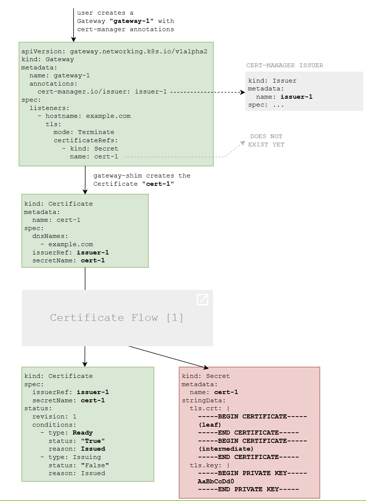

- [Introdução](#introdução)
- [Instalação do Gateway API](#instalação-do-gateway-api)
- [Implantando um Gateway simples](#implantando-um-gateway-simples)
- [Recurso Gateway Anotado](#recurso-gateway-anotado)
- [Dois listeners com o mesmo nome de Secret](#dois-listeners-com-o-mesmo-nome-de-secret)
- [Anotações Suportadas](#anotações-suportadas)
- [Diagrama](#diagrama)
- [Anotações - nginx-ingress x Gateway API](#anotações---nginx-ingress-x-gateway-api)


# Introdução
O Gateway API é um projeto oficial do Kubernetes focado em roteamento L4 e L7 no Kubernetes. Este projeto representa a próxima geração de Ingress do Kubernetes, Balanceamento de Carga e APIs de Malha de Serviços. Desde o início, foi projetado para ser genérico, expressivo e orientado a funções.

O modelo geral de recursos foca em 3 personas separadas e os recursos correspondentes que se espera que gerenciem:


A maior parte da configuração nesta API está contida na camada de Roteamento. Esses recursos específicos de protocolo (HTTPRoute, GRPCRoute, etc.) permitem capacidades avançadas de roteamento tanto para Ingress quanto para Malha.

O logotipo da Gateway API ajuda a ilustrar o duplo propósito desta API, permitindo o roteamento tanto para tráfego Norte-Sul (Ingress) quanto para tráfego Leste-Oeste (Malha) compartilhar a mesma configuração.

# Instalação do Gateway API

O canal de lançamento padrão inclui todos os recursos que graduaram para GA ou beta, incluindo GatewayClass, Gateway, HTTPRoute e ReferenceGrant. Para instalar este canal, execute o seguinte comando kubectl:

```sh
kubectl apply --server-side -f https://github.com/kubernetes-sigs/gateway-api/releases/download/v1.4.1/standard-install.yaml
```

# Implantando um Gateway simples
Este guia é um ótimo lugar para começar se você é novo no Gateway API. Ele mostra a implantação mais simples possível: um Gateway e um recurso Route implantados juntos pelo mesmo proprietário. Isso representa um tipo de modelo usado para Ingress. Neste guia, um Gateway e HTTPRoute são implantados, que correspondem a todo o tráfego HTTP e o direcionam para um único Serviço chamado foo-svc.


```sh
apiVersion: gateway.networking.k8s.io/v1
kind: Gateway
metadata:
  name: prod-web
spec:
  gatewayClassName: example
  listeners:
  - protocol: HTTP
    port: 80
    name: prod-web-gw
    allowedRoutes:
      namespaces:
        from: Same
```

O Gateway representa a instanciação de um balanceador de carga lógico e o GatewayClass define o modelo do balanceador de carga quando os usuários criam um Gateway. O Gateway de exemplo é modelado a partir de um hipotético GatewayClass de exemplo, que deve ser um espaço reservado e substituído pelos usuários. Aqui está uma lista das Implementações de Gateway disponíveis que podem ser usadas para determinar o GatewayClass correto com base no provedor de infraestrutura específico.

O Gateway escuta o tráfego HTTP na porta 80. Esta classe de Gateway em particular atribui automaticamente um endereço IP que será exibido no Gateway.status após a implantação.

Os recursos Route especificam os Gateways aos quais desejam se conectar usando ParentRefs. Desde que o Gateway permita essa conexão (por padrão, as Rotas do mesmo namespace são confiáveis), isso permitirá que a Rota receba tráfego do Gateway pai. BackendRefs definem os backends para os quais o tráfego será enviado. Correspondência e permissões bidirecionais mais complexas são possíveis e explicadas em outros guias.

O seguinte HTTPRoute define como o tráfego do listener do Gateway é roteado para os backends. Como não há rotas de host ou caminhos especificados, este HTTPRoute corresponderá a todo o tráfego HTTP que chegar à porta 80 do balanceador de carga e o enviará para os Pods do foo-svc.


```sh
apiVersion: gateway.networking.k8s.io/v1
kind: HTTPRoute
metadata:
  name: foo
spec:
  parentRefs:
  - name: prod-web
  rules:
  - backendRefs:
    - name: foo-svc
      port: 8080
```

Embora os recursos Route sejam frequentemente usados para filtrar tráfego para muitos backends diferentes (potencialmente com diferentes proprietários), isso demonstra a rota mais simples possível com um único backend de Serviço. Este exemplo mostra como um proprietário de serviço pode implantar tanto o Gateway quanto o HTTPRoute para seu uso exclusivo, dando a ele mais controle e autonomia sobre como o serviço é exposto.

# Recurso Gateway Anotado

As anotações cert-manager.io/issuer ou cert-manager.io/cluster-issuer dizem ao cert-manager para criar um Certificado para um Gateway. Por exemplo, o seguinte Gateway acionará a criação de um Certificado com o nome example-com-tls:

```sh
apiVersion: gateway.networking.k8s.io/v1
kind: Gateway
metadata:
  name: example
  annotations:
    cert-manager.io/issuer: foo
spec:
  gatewayClassName: foo
  listeners:
    - name: http
      hostname: example.com
      port: 443
      protocol: HTTPS
      allowedRoutes:
        namespaces:
          from: All
      tls:
        mode: Terminate
        certificateRefs:
          - name: example-com-tls
```

Poucos momentos depois, o cert-manager criará um Certificado. O Certificado é nomeado após o nome do Secret example-com-tls. O campo dnsNames é definido com o campo hostname da especificação do Gateway.

```sh
apiVersion: cert-manager.io/v1
kind: Certificate
metadata:
  name: example-com-tls
spec:
  issuerRef:
    name: my-issuer
    kind: Issuer
    group: cert-manager.io
  dnsNames:
    - example.com # ✅ Copiado do campo `hostname`.
  secretName: example-com-tls
```

# Dois listeners com o mesmo nome de Secret
O mesmo nome de Secret pode ser reutilizado em vários blocos TLS, independentemente do nome do host. Vamos imaginar que você tem esses dois listeners:

```sh
apiVersion: gateway.networking.k8s.io/v1
kind: Gateway
metadata:
  name: example
  annotations:
    cert-manager.io/issuer: my-issuer
spec:
  gatewayClassName: foo
  listeners:
    # Listener 1.
    - name: example-1
      hostname: example.com
      port: 443
      protocol: HTTPS
      tls:
        mode: Terminate
        certificateRefs:
          - name: example-com-tls

    # Listener 2: Mesmo nome de Secret que o Listener 1, com um nome de host diferente.
    - name: example-2
      hostname: "*.example.com"
      port: 443
      protocol: HTTPS
      tls:
        mode: Terminate
        certificateRefs:
          - name: example-com-tls

    # Listener 3: também mesmo nome de Secret, exceto que o nome do host também é o mesmo.
    - name: example-3
      hostname: "*.example.com"
      port: 8443
      protocol: HTTPS
      tls:
        mode: Terminate
        certificateRefs:
          - name: example-com-tls

   # Listener 4: nome de Secret diferente.
    - name: example-4
      hostname: site.org
      port: 443
      protocol: HTTPS
      tls:
        mode: Terminate
        certificateRefs:
          - name: site-org-tls
```

# Anotações Suportadas
Se você está migrando para recursos Gateway a partir de recursos Ingress, esteja ciente de que existem algumas diferenças entre as anotações para recursos Ingress e as anotações para recursos Gateway.

O recurso Gateway suporta as seguintes anotações para gerar recursos Certificate:

- **cert-manager.io/issuer:** o nome do Issuer que deve emitir o certificado necessário para este Gateway. O Issuer deve estar no mesmo namespace que o recurso Gateway.

- cert-manager.io/cluster-issuer: o nome de um cert-manager.io ClusterIssuer para adquirir o certificado necessário para este Gateway. Não importa em qual namespace seu Gateway reside, pois os ClusterIssuers são recursos não pertencentes a namespace.

- cert-manager.io/issuer-kind: o tipo do recurso emissor externo, por exemplo, AWSPCAIssuer. Isso é necessário apenas para emissores fora da árvore.

- cert-manager.io/issuer-group: o grupo API do controlador de emissor externo, por exemplo, awspca.- cert-manager.io. Isso é necessário apenas para emissores fora da árvore.

- cert-manager.io/common-name: (opcional) esta anotação permite que você configure o campo spec.commonName para o Certificado a ser gerado.

- cert-manager.io/email-sans: (opcional) esta anotação permite que você configure o campo spec.emailAddresses para o Certificado a ser gerado. Suporta valores separados por vírgula, por exemplo, "me@example.com,you@example.com"

- cert-manager.io/subject-organizations: (opcional) esta anotação permite que você configure o campo spec.subject.organizations para o Certificado a ser gerado. Suporta valores separados por vírgula, por exemplo, "Company 1,Company 2"

- cert-manager.io/subject-organizationalunits: (opcional) esta anotação permite que você configure o campo spec.subject.organizationalUnits para o Certificado a ser gerado. Suporta valores separados por vírgula, por exemplo, "IT Services,Cloud Services"

- cert-manager.io/subject-countries: (opcional) esta anotação permite que você configure o campo spec.subject.countries para o Certificado a ser gerado. Suporta valores separados por vírgula, por exemplo, "Country 1,Country 2"

- cert-manager.io/subject-provinces: (opcional) esta anotação permite que você configure o campo spec.subject.provinces para o Certificado a ser gerado. Suporta valores separados por vírgula, por exemplo, "Province 1,Province 2"

- cert-manager.io/subject-localities: (opcional) esta anotação permite que você configure o campo spec.subject.localities para o Certificado a ser gerado. Suporta valores separados por vírgula, por exemplo, "City 1,City 2"

- cert-manager.io/subject-postalcodes: (opcional) esta anotação permite que você configure o campo spec.subject.postalCodes para o Certificado a ser gerado. Suporta valores separados por vírgula, por exemplo, "123ABC,456DEF"

- cert-manager.io/subject-streetaddresses: (opcional) esta anotação permite que você configure o campo spec.subject.streetAddresses para o Certificado a ser gerado. Suporta valores separados por vírgula, por exemplo, "123 Example St,456 Other Blvd"

- **cert-manager.io/subject-serialnumber:** (opcional) esta anotação permite que você configure o campo spec.subject.serialNumber para o Certificado a ser gerado. Suporta valores separados por vírgula, por exemplo, "10978342379280287615,1111144445555522228888"

- **cert-manager.io/duration:** (opcional) esta anotação permite que você configure o campo spec.duration para o Certificado a ser gerado.

- **cert-manager.io/renew-before:** (opcional) esta anotação permite que você configure o campo spec.renewBefore para o Certificado a ser gerado.

- **cert-manager.io/usages:** (opcional) esta anotação permite que você configure o campo spec.usages para o Certificado a ser gerado. Passe uma string com valores separados por vírgula, ou seja, "key agreement,digital signature, server auth"

- **cert-manager.io/revision-history-limit:** (opcional) esta anotação permite que você configure o campo spec.revisionHistoryLimit para limitar o número de CertificateRequests a serem mantidos para um Certificado. O valor mínimo é 1. Se não definido, todos os CertificateRequests serão mantidos.

- **cert-manager.io/private-key-algorithm:** (opcional) esta anotação permite que você configure o campo spec.privateKey.algorithm para definir o algoritmo para geração da chave privada para um Certificado. Os valores válidos são RSA, ECDSA e Ed25519. Se não definido, um algoritmo RSA será usado.

- **cert-manager.io/private-key-encoding:** (opcional) esta anotação permite que você configure o campo spec.privateKey.encoding para definir a codificação para geração da chave privada para um Certificado. Os valores válidos são PKCS1 e PKCS8. Se não definido, um algoritmo PKCS1 será usado.

- **cert-manager.io/private-key-size:** (opcional) esta anotação permite que você configure o campo spec.privateKey.size para definir o tamanho da chave privada para um Certificado. Se o algoritmo estiver definido como RSA, os valores válidos são 2048, 4096 ou 8192, e o padrão será 2048 se não especificado. Se o algoritmo estiver definido como ECDSA, os valores válidos são 256, 384 ou 521, e o padrão será 256 se não especificado. Se o algoritmo estiver definido como Ed25519, o tamanho é ignorado.

- **cert-manager.io/private-key-rotation-policy:** (opcional) esta anotação permite que você configure o campo spec.privateKey.rotationPolicy para definir a política de rotação da chave privada para um Certificado. Os valores válidos são Nunca e Sempre. Se não definido, uma política de rotação Sempre será usada.

# Diagrama




# Anotações - nginx-ingress x Gateway API

| Anotação nginx-ingress | Equivalente Gateway API |
|---|---|
| `rewrite-target: /` | `URLRewrite` filter com `ReplaceFullPath` |
| `cert-manager.io/cluster-issuer` | `Gateway.spec.listeners[].tls.certificateRefs` |
| `auth-type: "basic"` + `auth-secret` | `HTTPRouteAuthFilter` customizado |
| `affinity: "cookie"` + `session-cookie-name` | `HTTPRouteAffinityFilter` customizado |
| `upstream-hash-by: "$request_uri"` | `HTTPRouteHashFilter` customizado |
| `limit-rps: "2"` | `HTTPRouteRateLimitFilter` customizado |
| `canary: "true"` + `canary-weight: "10"` | Múltiplas `HTTPRoute` com `backendRefs.weight` |

> [!NOTE]
> Nota importante: Gateway API separa responsabilidades melhor que Ingress. Filtros customizados (auth, affinity, hash, rate-limit) requerem extensões específicas do seu gateway controller. Os arquivos refletem a estrutura padrão esperada.